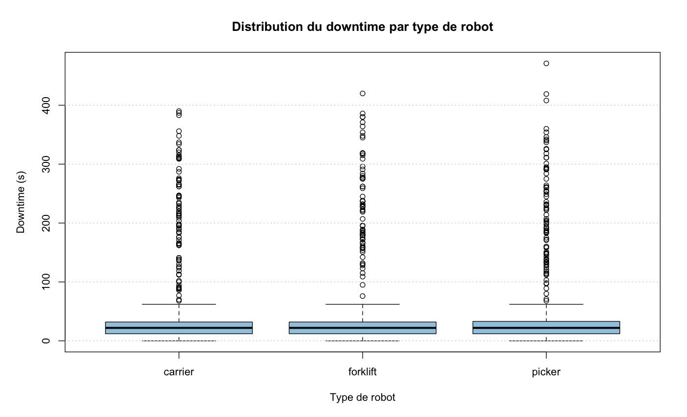

# 14 — Dataviz robots avec Python

---

## Positionnement du chapitre

- extraction SQL propre
- mise en DataFrame
- visualisation pour decision operationnelle

Objectif:
`question metier -> graphique lisible -> action`

---

## Fil rouge data robots

Cas:
flotte de robots logistiques en entrepot.

Questions:
- Pourquoi la productivite baisse de 14h a 16h ?
- Quelles zones causent le plus d'arrets ?
- Quel lien entre temperature, batterie et erreurs ?

---

## Schema de donnees minimal

Colonnes:
- `timestamp`, `robot_id`, `robot_type`, `zone`
- `task_type`, `mission_duration_s`, `downtime_s`
- `battery_pct`, `speed_mps`, `temperature_c`
- `error_code`, `mission_status`

Bon grain:
1 ligne = 1 mission robot.

---

## Pipeline technique

`SQL/Postgres -> CSV/API -> Pandas -> Dataviz -> recommandations`

```python
import numpy as np
import pandas as pd
import matplotlib.pyplot as plt
import seaborn as sns
```

Reglage style:

```python
sns.set_theme(style="whitegrid", context="talk")
plt.rcParams["figure.figsize"] = (11, 6)
```


---

## Chargement + qualite des donnees

```python
df = pd.read_csv("data/robots_missions.csv", parse_dates=["timestamp"])

df = df.drop_duplicates()
df["battery_pct"] = pd.to_numeric(df["battery_pct"], errors="coerce")
df["mission_duration_s"] = pd.to_numeric(df["mission_duration_s"], errors="coerce")

df = df[df["mission_duration_s"] > 0]
df = df[df["battery_pct"].between(0, 100)]
```

---

## Features utiles pour la dataviz

```python
df["hour"] = df["timestamp"].dt.hour
df["day"] = df["timestamp"].dt.date
df["is_error"] = np.where(df["error_code"].notna(), 1, 0)
df["efficiency"] = df["mission_duration_s"] / (df["downtime_s"] + 1)
```

Aggregats de base:

```python
kpi_hour = df.groupby("hour", as_index=False).agg(
    missions=("robot_id", "count"),
    error_rate=("is_error", "mean"),
    avg_battery=("battery_pct", "mean"),
)
```

---

## Choisir le bon graphique

- Evolution temporelle -> `lineplot`
- Comparaison categories -> `barplot` / `boxplot`
- Distribution -> `histplot` / `kdeplot`
- Relation entre 2 variables -> `scatterplot`
- Correlation multi-variables -> `heatmap`

Regle:
un graphique = une question principale.

---

## Exemple 1 — charge horaire de la flotte

```python
plt.plot(kpi_hour["hour"], kpi_hour["missions"], marker="o")
plt.title("Missions par heure")
plt.xlabel("Heure")
plt.ylabel("Nb missions")
plt.xticks(range(0, 24, 2))
plt.tight_layout()
plt.show()
```

identifier creux/pics et les rapprocher du staffing.

---

## Rendu — Missions par heure


---

## Exemple 2 — distribution batterie

```python
sns.histplot(df, x="battery_pct", bins=20, kde=True, color="#1f77b4")
plt.title("Distribution du niveau de batterie")
plt.xlabel("Batterie (%)")
plt.ylabel("Frequence")
plt.tight_layout()
plt.show()
```

si masse sous 20%, risque d'arret operationnel.

---

## Rendu — Distribution batterie


---

## Exemple 3 — erreurs par zone

```python
zone_err = (
    df.groupby("zone", as_index=False)["is_error"]
      .mean()
      .sort_values("is_error", ascending=False)
)

sns.barplot(data=zone_err, x="is_error", y="zone", palette="Reds_r")
plt.title("Taux d'erreur moyen par zone")
plt.xlabel("Taux d'erreur")
plt.ylabel("Zone")
plt.tight_layout()
plt.show()
```

---

## Rendu — Erreurs par zone


---

## Exemple 3 bis — boxplot downtime par type de robot

```python
def upper_whisker(s):
    q1, q3 = s.quantile([0.25, 0.75])
    iqr = q3 - q1
    return q3 + 1.5 * iqr

upper = df.groupby("robot_type")["downtime_s"].apply(upper_whisker).max()
sns.boxplot(data=df, x="robot_type", y="downtime_s", showfliers=False)
plt.ylim(0, upper * 1.05)
plt.title("Distribution du downtime par type (coeur de distribution)")
plt.xlabel("Type de robot")
plt.ylabel("Downtime (s)")
plt.tight_layout()
plt.show()
```

La mediane = ligne dans la boite, la  variabilite = hauteur de la boite (IQR). Les outliers sont masques ici pour la lisibilite.

---

## Rendu — Boxplot downtime par type



---

## Boxplot — lecture explicite (a retenir)

- boite: de `Q1` (25%) a `Q3` (75%)
- ligne dans la boite: `mediane` (`Q2`)
- `IQR = Q3 - Q1`
- moustaches: dernier point dans `[Q1 - 1.5*IQR ; Q3 + 1.5*IQR]`
- outliers: points hors moustaches

```python
s = df.loc[df["robot_type"] == "carrier", "downtime_s"]
q1, q2, q3 = s.quantile([0.25, 0.50, 0.75])
iqr = q3 - q1
low, high = q1 - 1.5 * iqr, q3 + 1.5 * iqr
nb_outliers = ((s < low) | (s > high)).sum()
```

Pratique conseillee:
afficher le coeur de distribution dans le boxplot, et reporter `nb_outliers` a part.


---

## Pourquoi autant d'outliers sur ce dataset ?

1. La regle boxplot (`1.5 * IQR`) marque vite les queues longues.
2. `downtime_s` est asymetrique: beaucoup de petites valeurs + quelques incidents longs.
3. Le dataset simule des pics d'incidents (14h-16h, zone `C3`) pour la detection d'anomalies.

Ordre de grandeur observe:
- environ `241 / 5406` points (`4.46%`) classes outliers sur `downtime_s`.

---

## Exemple 4 — correlations capteurs

```python
num_cols = ["battery_pct", "speed_mps", "temperature_c", "mission_duration_s", "downtime_s"]
corr = df[num_cols].corr(numeric_only=True)

sns.heatmap(corr, annot=True, fmt=".2f", cmap="coolwarm", vmin=-1, vmax=1)
plt.title("Matrice de correlation")
plt.tight_layout()
plt.show()
```

Attention:
correlation != causalite.

---

## Rendu — Correlation capteurs


---

## Exemple 5 — Seaborn facettes

```python
sns.relplot(
    data=df,
    x="battery_pct",
    y="mission_duration_s",
    col="robot_type",
    hue="zone",
    kind="scatter",
    alpha=0.6,
    height=4
)
```

Interet:
comparer rapidement les comportements par type de robot.

---

## Approfondissement technique: detection d'erreurs

4 niveaux complementaires:
- niveau 1: seuil metier (ex: batterie < 15%)
- niveau 2: comparaison au baseline (robot/zone/heure)
- niveau 3: detection statistique (z-score, IQR, controle)
- niveau 4: evaluation (precision, rappel, faux positifs)

But:
passer du "j'observe" a "je detecte automatiquement".

---

## Exemple 6 — heatmap erreurs (heure x zone)

```python
err_heat = (
    df.groupby(["zone", "hour"], as_index=False)["is_error"]
      .mean()
      .pivot(index="zone", columns="hour", values="is_error")
      .fillna(0)
)

sns.heatmap(err_heat, cmap="Reds", vmin=0, vmax=1)
plt.title("Taux d'erreur par zone et par heure")
plt.xlabel("Heure")
plt.ylabel("Zone")
plt.tight_layout()
plt.show()
```

Usage:
isoler les couloirs et tranches horaires critiques.

---

## Rendu — Heatmap erreurs zone x heure


---

## Exemple 7 — carte de controle (moyenne mobile + 3 sigma) 1/2

```python
ts = (
    df.set_index("timestamp")
      .resample("15min")["is_error"]
      .mean()
      .rename("error_rate")
      .to_frame()
)

ts["mu_rolling"] = ts["error_rate"].rolling(16, min_periods=8).mean()
ts["sigma_rolling"] = ts["error_rate"].rolling(16, min_periods=8).std()
ts["upper"] = ts["mu_rolling"] + 3 * ts["sigma_rolling"]
ts["is_alert"] = ts["error_rate"] > ts["upper"]
```

---

## Exemple 7 — carte de controle (moyenne mobile + 3 sigma) 2/2


```python
plt.plot(ts.index, ts["error_rate"], label="error_rate")
plt.plot(ts.index, ts["mu_rolling"], label="moyenne mobile")
plt.plot(ts.index, ts["upper"], "--", label="limite haute 3 sigma")
plt.scatter(ts.index[ts["is_alert"]], ts.loc[ts["is_alert"], "error_rate"], c="red", s=20, label="alerte")
plt.legend()
plt.title("Detection d'anomalies temporelles sur le taux d'erreur")
plt.tight_layout()
plt.show()
```

---

## Rendu — Carte de controle


---

## Exemple 8 — score d'anomalie multivariable 1/2

Variables:
`downtime_s`, `mission_duration_s`, `battery_pct`, `temperature_c`.

```python
feat = ["downtime_s", "mission_duration_s", "battery_pct", "temperature_c"]
z = (df[feat] - df[feat].mean()) / df[feat].std(ddof=0)
df["anomaly_score"] = np.sqrt((z ** 2).sum(axis=1))

threshold = df["anomaly_score"].quantile(0.99)
df["is_anomaly"] = df["anomaly_score"] >= threshold
```

---

## Exemple 8 — score d'anomalie multivariable 2/2


```python
sns.scatterplot(
    data=df,
    x="mission_duration_s",
    y="downtime_s",
    hue="is_anomaly",
    palette={False: "#1f77b4", True: "#d62728"},
    alpha=0.6
)
plt.title("Points anormaux selon score multivariable")
plt.tight_layout()
plt.show()
```

---

## Rendu — Score d'anomalie


---

## Exemple 9 — baseline par robot et ecart relatif

```python
baseline = (
    df.groupby(["robot_id", "hour"], as_index=False)["downtime_s"]
      .median()
      .rename(columns={"downtime_s": "downtime_baseline"})
)

df2 = df.merge(baseline, on=["robot_id", "hour"], how="left")
df2["downtime_ratio"] = df2["downtime_s"] / (df2["downtime_baseline"] + 1)
```

```python
sns.boxplot(data=df2, x="robot_type", y="downtime_ratio")
plt.axhline(2.0, ls="--", c="red")
plt.title("Ecart au baseline de downtime (par type robot)")
plt.ylabel("Ratio vs baseline")
plt.tight_layout()
plt.show()
```

Interpretation:
ratio > 2 = comportement degrade vs historique comparable.

---

## Rendu — Ecart au baseline


---

## Exemple 10 — matrice de confusion (si labels incidents)

Si vous avez une verite terrain:
- `incident_label` (0/1)
- `pred_alert` (0/1) issue de la regle de detection

```python
cm = pd.crosstab(df["incident_label"], df["pred_alert"])
cm = cm.reindex(index=[0, 1], columns=[0, 1], fill_value=0)

sns.heatmap(cm, annot=True, fmt="d", cmap="Blues")
plt.title("Matrice de confusion de la detection")
plt.xlabel("Alerte predite")
plt.ylabel("Incident reel")
plt.tight_layout()
plt.show()
```

Objectif:
reduire les faux positifs sans rater les vrais incidents.

---

## Rendu — Matrice de confusion


---

## Atelier 1 (guide, 45 min)

Produire 3 graphes:
1. missions par heure
2. erreurs par zone
3. distribution downtime

Contraintes:
- titre utile
- axes nommes + unite
- 1 phrase d'insight par graphe

---

## Atelier 2 (mini-projet, 75 min)

Question imposee:
"Pourquoi la productivite baisse entre 14h et 16h ?"

Livrable:
- 4 a 6 visualisations
- au moins 1 graphique technique de detection d'anomalie
- 1 slide de synthese:
  - constat
  - hypothese
  - action recommandee

---

## Evaluation (formative)

- Qualite technique notebook: 30%
- Qualite des visualisations: 40%
- Lecture metier + recommandations: 30%

Bonus:
- reproductibilite (fonctions, cellules propres)
- clarte narrative (ordre des graphes)

---

## Checklist avant rendu

- pas de valeurs aberrantes non traitees
- pas de graphique surcharge
- meme palette et meme echelle quand comparaison
- message principal explicite dans chaque titre
- conclusion orientee action

---

## Conclusion

Ce chapitre fait le lien entre:
- base de donnees
- analyse Python
- prise de decision terrain

Prochaine etape possible:
industrialiser avec dashboard (`streamlit` / `dash`) et rafraichissement automatique.
